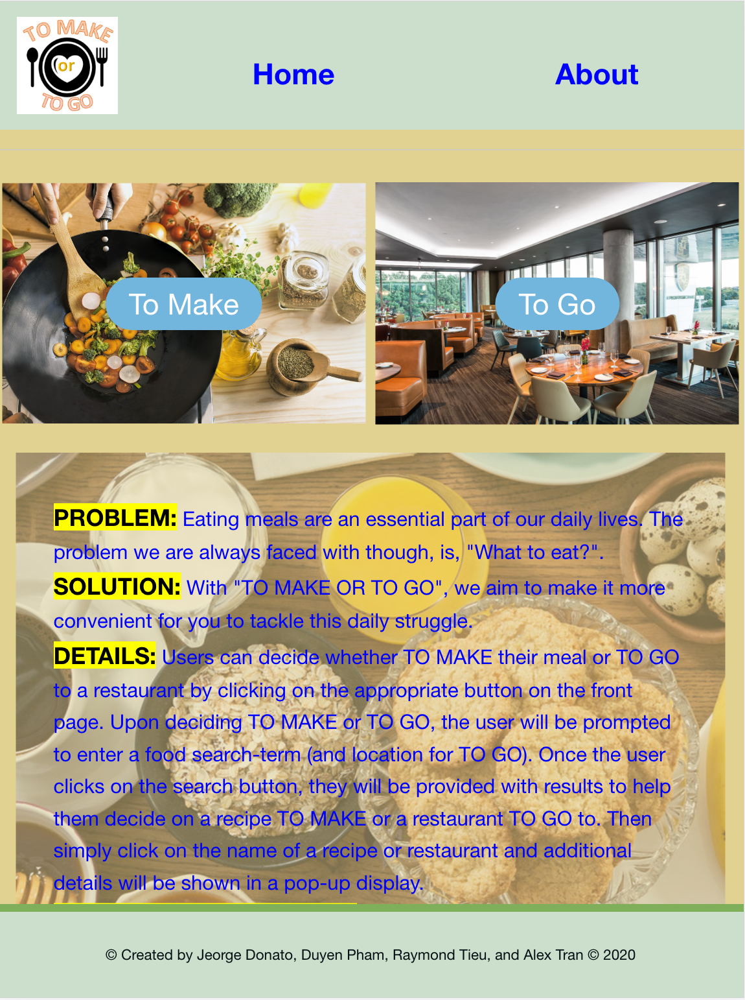
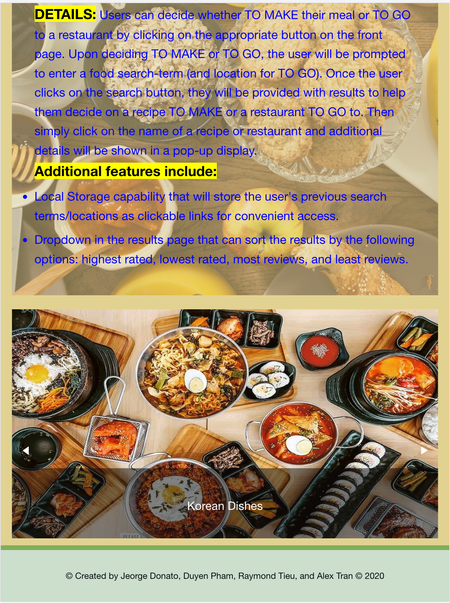

# to-make-or-to-go
UCI Project 1, To Make or To Go

### PROJECT TITLE: 
```To Make or To Go```

### PROJECT DESCRIPTION: 
```
Eating meals are an essential part of our daily lives. The problem we are always faced with though, is, "What to eat?"  
With "TO MAKE OR TO GO", we aim to make it more convenient for you to tackle this daily struggle.

Users can decide whether TO MAKE their meal or TO GO to a restaurant by clicking on the appropriate button on the front page. Upon deciding TO MAKE or TO GO, the user will be prompted to enter a food search-term (and location for TO GO). Once the user clicks on the search button, they will be provided with results to help them decide on a recipe TO MAKE or a restaurant TO GO to.  Then simply click on the name of a recipe or restaurant and additional details will be shown in a pop-up display.

Additional features include:  
-Local Storage capability that will store the user's previous search terms/locations as clickable links for convenient access.  
-Dropdown in the results page that can sort the results by the following options: highest rated, lowest rated, most reviews, and least reviews.

```

### USER STORY:
```
AS a hungry person
I WANT to see a list of possible recipes and/or restaurants 
SO THAT I can decide to either cook a meal or dine out
```

### APIS USED: 
```
Google Map
Tasty
Yelp
```
### Application's Screenshots:



### Link:
https://raytieu.github.io/to-make-or-to-go/
